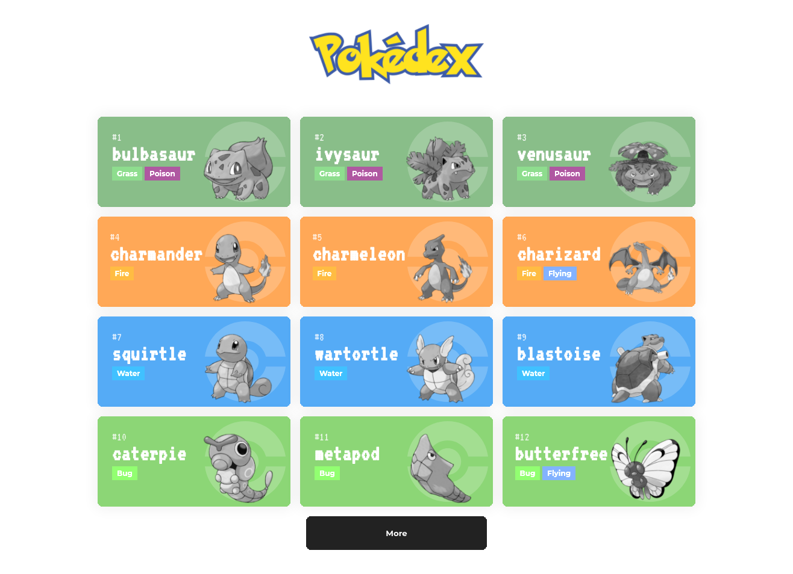
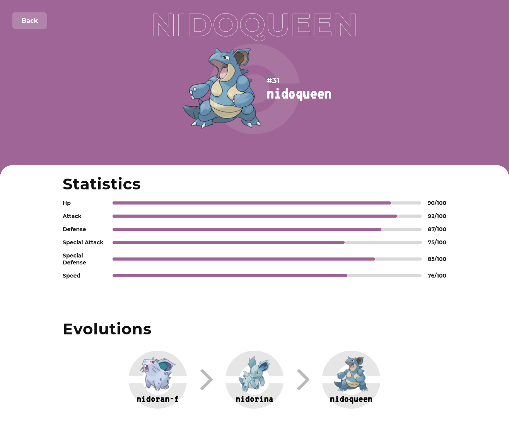

<div align="center">
  
</div>

## Screenshot
<div align="center">
  
</div>

<div align="center">
  
</div>

## Development

To run your Remix app locally, make sure your project's local dependencies are installed:

```sh
npm install
```

Afterwards, start the Remix development server like so:

```sh
npm run dev
```

Open up [http://localhost:3000](http://localhost:3000) and you should be ready to go!

If you're used to using the `vercel dev` command provided by [Vercel CLI](https://vercel.com/cli) instead, you can also use that, but it's not needed.
